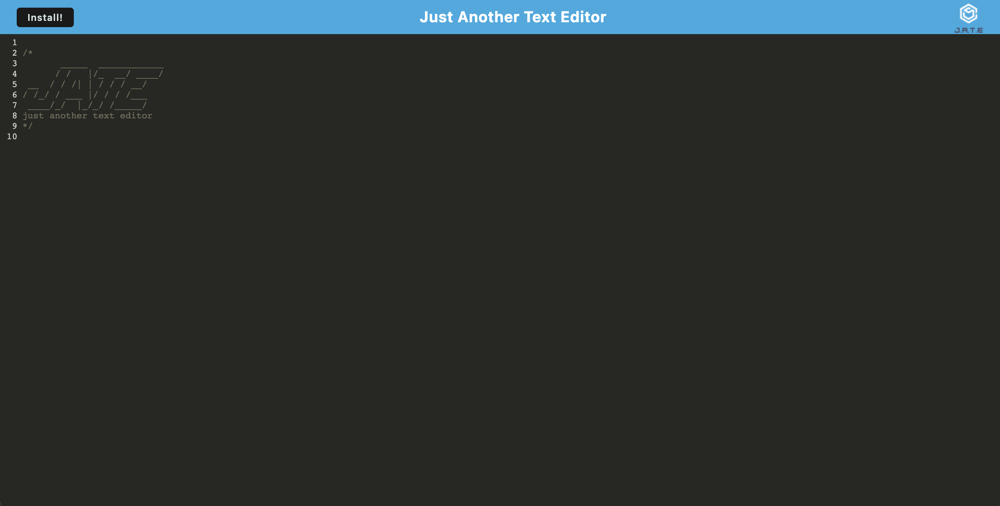
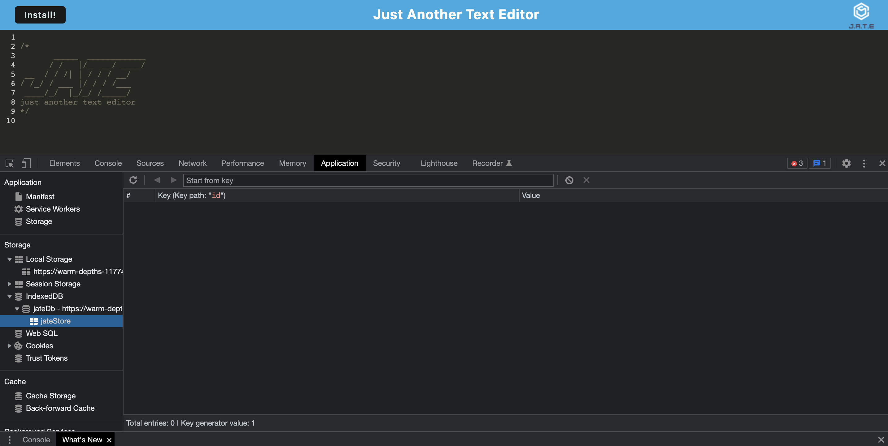
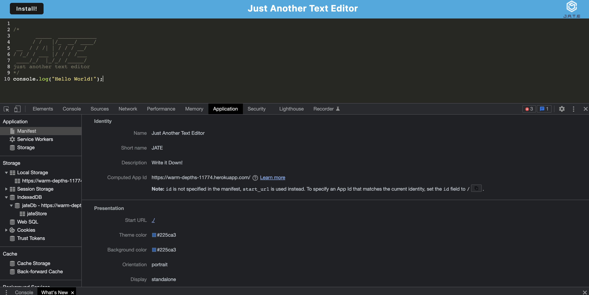

# 🏗️ Text Editor PWA

Link : https://warm-depths-11774.herokuapp.com/

## Description 📖

This project a **text editor** that runs in the browser. *Text Editor* is a PWA, single-page application. Additionally, it features a number of data persistence techniques that serve as redundancy in case one of the options is not supported by the browser. The application also functions offline.

## Features 📝

*Text Editor* implements methods for getting and storing data to an IndexedDB database. It uses a package called ``idb``, which is a lightweight wrapper around the IndexedDB API. It features a number of methods that are useful for storing and retrieving data. The app also uses a number of service workers which are configured in the webpack, including the ``WebPackPwaManifest`` plugin.

## Screenshots 📷 :

* Example of the open text editor:

  
  
* Shows the indexedDB:

  

* Shows the generated manifiest:

  
  

## Takeaways 💡

I learned how to create a simple PWA.

----
© 2021 Caswell Orr. Confidential and Proprietary. All Rights Reserved.